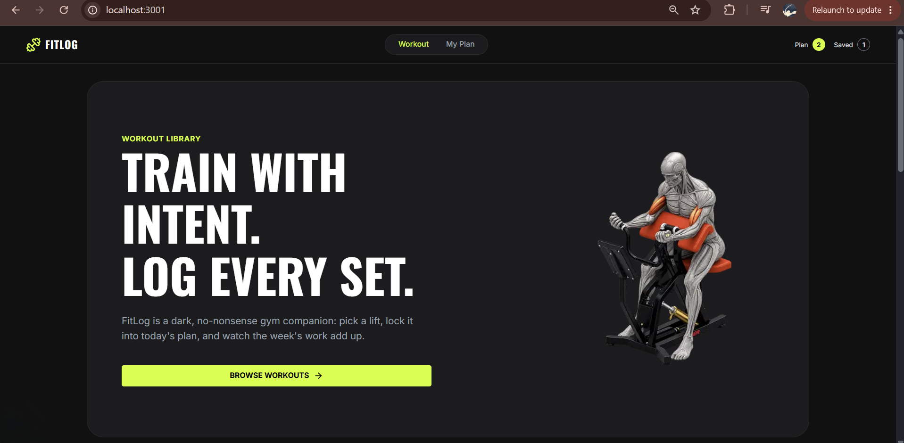

<div align="center">
  
  <h1 style="margin-top: 0;">FitLog — Train With Intent</h1>

  <p>
    FitLog is a dark, no-nonsense gym companion. Browse a comprehensive library of exercises, pick your lifts, lock them into today's plan, and track your metrics.
  </p>

  <p>
    <a href="https://nextjs.org/"></a>
    <a href="https://www.typescriptlang.org/"></a>
    <a href="https://tailwindcss.com/"></a>
    <a href="https://react.dev/"></a>
  </p>

  <h3><a href="https://fit-log-theta-five.vercel.app/">Live Demo 🚀</a></h3>
</div>

---

## 📸 Overview

> **

## ✨ 5 Key Features

1. **🏋️ Comprehensive Workout Library:** Fetches and displays a dynamic 3x4 responsive grid of exercises from an external API, complete with skeleton loading states and category tags.
2. **📖 Dynamic Details Routing:** Dedicated dynamic pages (`/workout/[id]`) for every exercise detailing equipment, difficulty, sets, reps, and step-by-step instructions.
3. **📋 Strict Plan Management:** Utilizes React Context API to seamlessly add workouts to "Today's Plan" or a "Saved" list, featuring a strict **5-lift cap logic** for active plans.
4. **📊 Live Metrics Tracking:** Automatically calculates and displays real-time summary metrics (total exercises, duration, and calories burned) based on your active plan tab.
5. **💾 Data Persistence & Sorting:** Saves all planned and saved workouts to `localStorage` safely to survive page reloads. Includes a functional dropdown to sort lists by duration, calories, or rating, and visual strike-throughs for completed routines.

## 🛠️ Technologies Used

- **Next.js 16** (App Router) — routing, page structure, and rendering
- **TypeScript** — type-safe components and API data models
- **Tailwind CSS** + **DaisyUI** — styling, responsive layout, and UI components
- **React Context API** — global state for the plan/saved workout lists
- **react-hot-toast** — toast notifications for user actions
- **localStorage** — client-side persistence across page reloads

## ⚙️ Getting Started

First, run the development server:

```bash
npm run dev
# or
yarn dev
# or
pnpm dev
# or
bun dev
```

Then open [http://localhost:3000](http://localhost:3000) in your browser to see the app.

## 🔗 Links

- **Live Site:** [fit-log-theta-five.vercel.app](https://fit-log-theta-five.vercel.app/)
- **Repository:** [github.com/Md-Rifat-Al-Faisal/fit-log](https://github.com/Md-Rifat-Al-Faisal/fit-log)